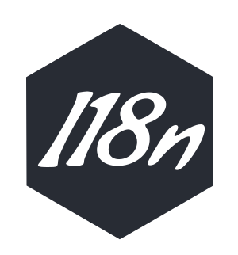

<p align="center"></p>
<h1 align="center">Crystal I18n</h1>
<p align="center">An internationalization library for Crystal.</p>
<p align="center">
  <a href="https://github.com/crystal-i18n/i18n/actions?query=branch%3Amaster+workflow%3ACI">
    
  </a>
</p>

<br />

**Crystal I18n** is an internationalization library for the Crystal programming language. It provides a unified interface 
allowing to leverage translations and localized contents in a Crystal project.

## Documentation

Online browsable documentation is available at https://crystal-i18n.github.io/i18n/.

## Installation

Simply add the following entry to your project's `shard.yml`:

```yaml
dependencies:
  i18n:
    github: crystal-i18n/i18n
```

And run `shards install` afterwards.

## Usage

Assuming that a `config/locales` relative folder exists in your project, with the following `en.yml` file in it:

```yaml
en:
  simple:
    translation: "This is a simple translation"
    interpolation: "Hello, %{name}!"
    pluralization:
      one: "One item"
      other: "%{count} items"
```

The following setup could be performed in order to initialize `I18n` properly:

```crystal
require "i18n"

I18n.config.loaders << I18n::Loader::YAML.new("config/locales")
I18n.config.default_locale = :en
I18n.init
```

Here a translation loader is configured to load the previous translation file while also configuring the default locale 
(`en`) and initializing the `I18n` module.

Translations lookups can now be performed using the `#translate` method (or the shorter version `#t`) as follows:

```crystal
I18n.t("simple.translation")                     # outputs "This is a simple translation"
I18n.t("simple.interpolation", name: "John Doe") # outputs "Hello, John Doe!"
I18n.t("simple.pluralization", count: 42)        # outputs "42 items"
```

Please head over to the [documentation](https://crystal-i18n.github.io/i18n/) for a more complete overview of the `I18n` 
module capabilities (including the configuration options, localization features, etc).

## Authors

Morgan Aubert ([@ellmetha](https://github.com/ellmetha)) and 
[contributors](https://github.com/crystal-i18n/i18n/contributors).

## License

MIT. See ``LICENSE`` for more details.
